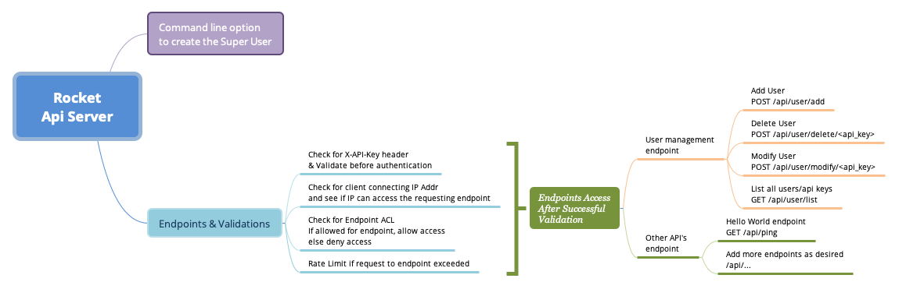

API REST Server using Rocket.rs
--------------------------------
[](https://travis-ci.com/marirs/rocketapi)

A Skeleton API Rest server using [Rocket](https://rocket.rs/) with the backend database as [MongoDB](https://www.mongodb.com/).

### Features
- Custom config file defining:
    - server host ip and port to listen
    - enable/disable ssl with ssl cert auto generation
    - mongodb configurations
- Use the `x-api-key` header to validate `API Keys`
- `Restrict` a client connecting IP Addresses to the endpoints using `Allow ACL`
- `Restrict` endpoints using the `Deny ACL`
- `Rate limiter` to throttle incoming requests to endpoints
- Extend this rocketapi server's boiler plate; with your endpoints



### Requirements

- Rust 1.56+ (2021 edition)

---
### Compile

```bash
cargo build --release
```

- Sample config file is available at `config.sample.yml`

### Starting the server
```bash
./target/release/rocketapi -f config.sample.yml
```

### Available endpoints

- Index/User management endpoint

| Description | Endpoint | Method |
| --- | --- | --- |
| Api index | `/` | GET |
| List all Users | `/users` | GET |
| Create user | `/users` | POST |
| Update user | `/users` | PUT |
| Delete user | `/users/<Email>` | DELETE |

### POST Request for `new user creation` / `user update`
The below example goes into json body of POST/PUT request while creating a new user
```
{
  "email": "email",
  "description": "...",
  "is_admin": false,
  "acl_allow_ips": ["127.0.0.1", "<IP_ADDRESS>"] // use ["*"] if you want to allow from any IP
  "acl_allow_endpoints": {
    "name": "/endpoint_name",
    "method": "GET", // use "*" if you want any methods to be allowed for this endpoint 
    "throttle": "4/min" // can use sec|min|hour|day
  }
}
```

### Seed data & Configuration

- Example with rate-limit (throttle)
```json
{
  "created_ip" : "127.0.0.1",
  "created_by" : "email",
  "created_at" : "2021-08-02T00:00:00Z",
  "email" : "email",
  "description": "...",
  "api_key" : "apikey123",
  "is_admin" : true,
  "acl_allow_ips" : [
    "*"
  ],
  "acl_allow_endpoints": [
    {"name": "/fair", "method": "*", "throttle": "4/min"}
  ]
}
```
- Example without rate-limit
```json
{
  "created_ip" : "127.0.0.1",
  "created_by" : "email",
  "created_at" : "2021-08-02T00:00:00Z",
  "email" : "email",
  "description": "...",
  "api_key" : "apikey123",
  "is_admin" : true,
  "acl_allow_ips" : [
    "*"
  ],
  "acl_allow_endpoints": [
    {"name": "*", "method": "*"} 
  ]
}
````

### Configs
The `configs` folder has configurations to start the server as a service and nginx config to server this rocketapi server in reverse proxy mode.
- Start the rocketapi server as a service
```text
1) copy the configs/rocketapi.service to /etc/systemd/system folder
2) systemctl enable rocketapi
3) systemctl start rocketapi
```

- Then you can copy the `configs/nginx.vhost` to `/etc/nginx/sites-enabled` to access the rocketapi server via nginx.

---

If you need a python version, a python fastapi version can be found [here](https://github.com/marirs/fastapi-boilerplate).

---
### Contribution

Feel free to make pull requests and make this better and/or contribute to its features.

---
Licensed under the Apache License, Version 2.0

